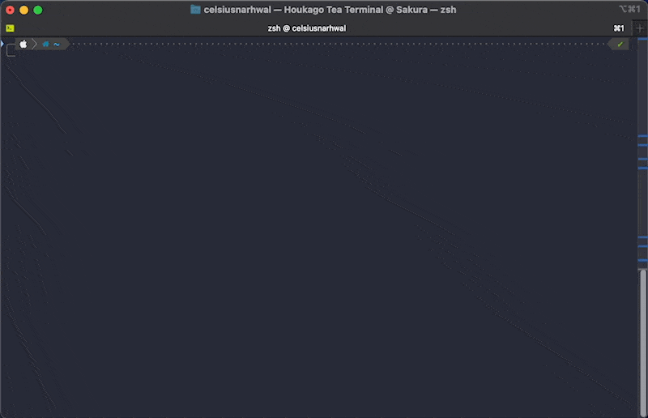
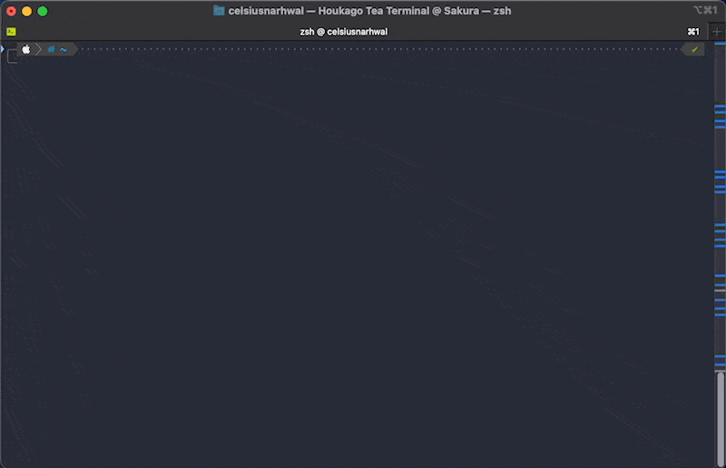
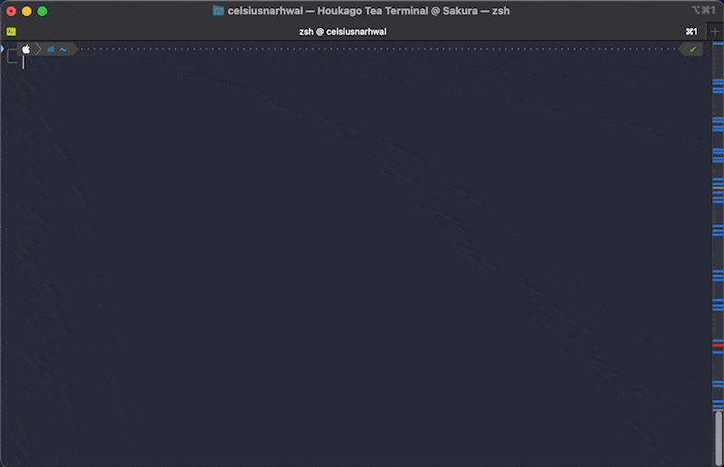
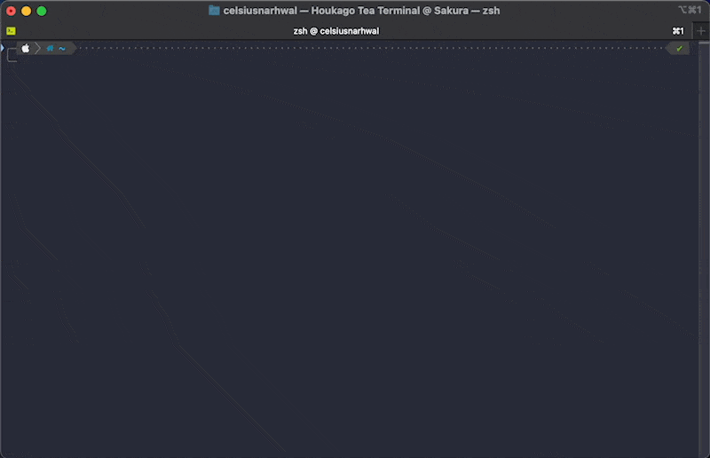

# Schemarin

Schemarin (skˈiːmɚɹˌɪn) is a color scheme manager for [iTerm2](https://iterm2.com/). Schemarin makes it easy to add
and remove color schemes, export them to share with others, or even preview them in your terminal.

## Installation

Install Schemarin with [Homebrew](https://brew.sh) via
the [Houkago Tea Tap](https://github.com/celsiusnarhwal/homebrew-htt).

```bash
brew tap celsiusnarhwal/htt
brew install schemarin
```

You can also build Schemarin from source, if that's your thing. See [Building Schemarin](building-schemarin.md).

## Features

### Adding color schemes

Schemarin comes with all 288 color schemes from
the [iTerm Color Schemes repository](https://github.com/mbadolato/iTerm2-Color-Schemes)
built-in and can add additional ones from local files or GitHub repositories — public or private![^1] Schemarin's
modern [InquirerPy](https://inquirerpy.readthedocs.io)-powered interface allows you to add hundreds of color schemes
with
just a few keystrokes.

<p style="text-align: center;border-radius: 50%;filter: drop-shadow(8px 8px 8px black)">
    
</p>

### Removing color schemes

Schemarin can remove any of your custom color schemes invidually or in bulk, regardless of whether or not you added
them with Schemarin.

<p style="text-align: center;border-radius: 50%;filter: drop-shadow(8px 8px 8px black)">
    
</p>

### Exporting color schemes

Schemarin can export any of your custom color schemes as iTermColors, JSON, XML or property list (plist) files. If you
export multiple schemes at once, Schemarin will automatically package them into a zip file.

<p style="text-align: center;border-radius: 50%;filter: drop-shadow(8px 8px 8px black)">
    
</p>

### Previewing color schemes

Schemarin can temporarily apply any of your custom color schemes to the current terminal session. You can use Schemarin
to quickly add a color scheme and then see what it looks like[^2] — without needing to restart iTerm2.[^3]

<p style="text-align: center;border-radius: 50%;filter: drop-shadow(8px 8px 8px black)">
    
</p>

## FAQ

### Q: I previewed a color scheme and it worked just fine (great feature btw) but now I can't get my terminal's original colors back!

A: Color scheme previews are applied to the current terminal session only. You can get back your original colors by
simply opening a new terminal tab or window.

### Q: What do you mean "there are no color schemes here that you don't already have"?

A: Schemarin actively prevents you from adding duplicates of color schemes that have already been added to
iTerm2. If you provide Schemarin with a file, directory, or GitHub repository that contains only color schemes
you already have (or no color schemes at all), Schemarin will throw a friendly little error message before returning
to the main menu.

### Q: You mentioned Schemarin could add color schemes from private GitHub repositories. How?

A: Schemarin obtains your GitHub credentials
with **[SHAMELESS PLUG]** [loctocat](https://github.com/celsiusnarhwal/loctocat)
**[END SHAMELESS PLUG]** and plugs them into [PyGithub](https://pygithub.readthedocs.io) which it then uses to access
the GitHub API. If you use Schemarin's default authentication method, GitHub will automatically grant it the necessary
permissions on your account. Schemarin also provides the option of authenticating with
a [personal access token](https://docs.github.com/en/authentication/keeping-your-account-and-data-secure/creating-a-personal-access-token),
but you will have to make sure the token you create has access to the appropriate repositories.

### Q: Can it access private repositories on other Git hosts, like GitLab or BitBucket?

A: No. It can't access public repositories on other hosts, either. Schemarin's Git-powered features only work
with GitHub.

### Q: What about GitHub Enterprise?

A: Also no. Sorry!

### Q: Can I make Schemarin the default app for iTermColors files?

A: Technically, the answer is *maybe*, but Schemarin has no features that would make that worthwhile (e.g. you wouldn't
be able to double-click a batch of iTermColors files and have Schemarin add them all at once). I actually wanted
to implement this kind of functionality, but it is ridiculously difficult to make a Python program set itself as the
default handler for certain file extensions on macOS, and it is only marginally less difficult for users to change
that setting themselves. Maybe one day.

### Q: I told Schemarin to scan a directory for color schemes and it came back telling me I didn't have permission to access it. What gives?

A: That's...pretty self-explanatory. 
See [Apple's documentation on changing file, folder, and disk permissions](https://support.apple.com/guide/mac-help/change-permissions-for-files-folders-or-disks-mchlp1203/mac).
Running Schemarin with `sudo` may solve the problem.

### Q: I told Schemarin to scan a directory for color schemes and it came back telling me the directory was protected by macOS. What gives?

A: Uh-oh. See [Schemarin and SIP](schemarin-and-sip.md).

## Acknowledgements

Schemarin's built-in color schemes are sourced
from [mbadolato/iTerm2-Color-Schemes](https://github.com/mbadolato/iTerm2-Color-Schemes).
The [import-scheme.sh](https://github.com/mbadolato/iTerm2-Color-Schemes/blob/master/tools/import-scheme.sh) script
in that repository directly inspired Schemarin's creation. Additionaly, Schemarin's color scheme preview feature was
inspired by
[Junegunn Choi](https://github.com/junegunn)'s [Ruby script](https://github.com/mbadolato/iTerm2-Color-Schemes/blob/master/tools/preview.rb)
for the same purpose.

Schemarin would obviously not be possible without the wonderful work of George Nachman and many contributors on
[iTerm2](https://github.com/gnachman/iTerm2).

## License

Schemarin is licensed under the [MIT License](LICENSE.md).

[^1]: If you enter a repository that appears to be private[^4], Schemarin ask you to to sign in to GitHub and will
attempt
to access the repository using your credentials. Schemarin discards your credentials once it no longer needs them,
and does not store them in any manner that would persist when Schemarin is not running.

[^2]: Color scheme previews may not be perfect reflections of what the color scheme will actually look like when you
apply it in iTerm2's preferences.

[^3]: You still need to restart iTerm2 for color schemes you've added with Schemarin to appear in `iTerm2` >
`Preferences...` > `Profiles` > `Colors` > `Color Presets...`.

[^4]: GitHub provides no way of differentiating between inaccessible private repositories and repositories that
actually don't exist. Schemarin assumes that any repository which returns a 404 is private.
